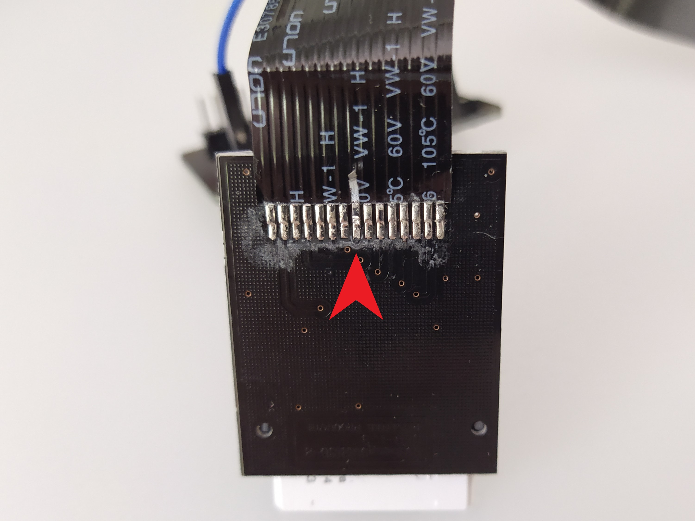

# Abstract
This project enables you to share one (micro) SD card between two devices without using a hardware multiplexer. Instead, a micro SD card adapter cable will be used while the SD card slot is also hooked on the SPI interface of an ESP32 Devkit board. Implementing a minimalistic web interface on the ESP32, the SD card can be accessed pseudo-simultanuously either via the cable or via WiFi. This setup has been tested to add the desired "WiFi capability" to a Creality Ender 3 3D printer.

# YAGNI
It is as simple as that: I just wanted to remotely load the 3D printer's SD card with my gcodes so that I just have to turn on my printer and start printing. This problem has already been solved several times. Here I explain why those solutions did not fit to my needs.
## Octoprint / Octopi
Octoprint (Octopi as a Raspberry Pi distribution) is heavily beloved by the maker community. This software is a huge piece of software and it is very handy and useful. Hovewer, printing from Octoprint or Uploading to the printer's SD card remains on a serial connection between the printer and the Raspberry Pi. Even with a shielded USB cable I had sporadic hardware failures showing up as `"ch341-uart ttyUSB0: usb_serial_generic_read_bulk_callback - urb stopped: -32"` in the kernel logs. This is not a problem with Octoprint but with the Raspi or with the printer. I got tired of finding a solution. 

Also, relying on a serial connection for printing just feels like stepping on the gas and on the brakes in the same time because the serial speed is the bottleneck in this game. Reading and executing the print instructions directly from SD card is just faster than running commands and all the overhead associated with through a serial connection, even when you increase baud speed. There are several threads around confirming better print quality when you print from SD card ([e.g. in this post](https://community.octoprint.org/t/ouch-sd-card-vs-octoprint-what-a-difference-help/8618/45)). And finally I am just not interested in the nozzle or bed temperature during print, nor do I monitor the printer's progress. The only thing I want is to be notified when the print has finished. This is achieved by monitoring the printer's power consumption through a tasmota enabled intelligent power supply plug and a telegram messenger.

## Klipper
Klipper offloads the conversion from gcode to motor movements to an external computer like the Raspberry Pi. This is smart and it has reported to improve print speeds and quality. Nevertheless, the whole technology relies on a stable serial connection in which I don't have much trust since i saw the errors in the kernel logs.

## Toshiba FlashAir
This was the first product that I thought will fulfill my needs. Unfortunately this WiFi-SD-card is discontinuoued. The FlashAirs left are extremely expensive - of course. There are similar products out there but the embedded webservers don't seem to provide upload capabilities. Only download from SD to your end device. Also, according to [this issue](https://github.com/Creality3DPrinting/Ender-3/issues/12), the supply voltage for the SD card is hooked to the Ender's serial chip reference voltage output which may not provide enough current for all (and especially WiFi capable) SD cards.

# What you need
Minor soldering skills and a good soldering iron.

## Micro-SD card to TF adapter cable

Open the slot-end and disrupt the power supply coming from the plug-end. You can do that with a small knife and ripping up the highlighted pad.

## ESP32 Devkit or similar
Add the folloing wires to your SD card slot.

Hook the wires accordingly on your ESP32 board.

You don't necessarily need to solder the wires on the ESP end. But I did to ensure the connectivity and safe space. Also, if you have unwanted behavior from the SD card this is may due to reflections on the cable. Adding 22Ohm resistors to the data lines may help.

## Add reset line
Don't forget to wire the EN line of the ESP32 with the IO pin 33 (it can also be another pin, but this would mean changing a field in the code). Why? The ESP32 can be reset via software (`esp_restart()`). However, when the SPI bus claimed the SD card, this "software reset" did not properly release it. Also manual releasing and uninitializing the SPI bus did not help. Only "pushing" the EN button or disrupting power helped to release the SD card so that the ender can use it.

## Add some glue
You may pack the whole thing so that the cables won't brake on the first touch. I intend to create a small housing for the whole thing.

## Upload firmware
A filesystem image containing static files served by the webserver has to be created and uploaded as well as the firmware itself. The `build.sh` script in the directory root explains it all.

## Tasmota intelligent plug
The printer cannot access the SD card as long as the ESP32 has claimed it. Only rebooting the claiming device properly releases the SD card. Yes, this is no simultanuous share between two devices, I know. However, you don't need to turn on and off your printer manually when you use an intelligent tasmota enabled power supply switch. I can recommend the Gosund SP112 device (as the USB ports can power the ESP32) or a Gosund SP1. With those devices you can switch your printer on and off remotely via REST-call or webinterface.

Note: This switch can also monitor the printer's power cosumption and act as MQTT client. Let a telegram bot send you a message when power consumption falls under 4 Watts for 2 minutes ;-) 

# Usage
